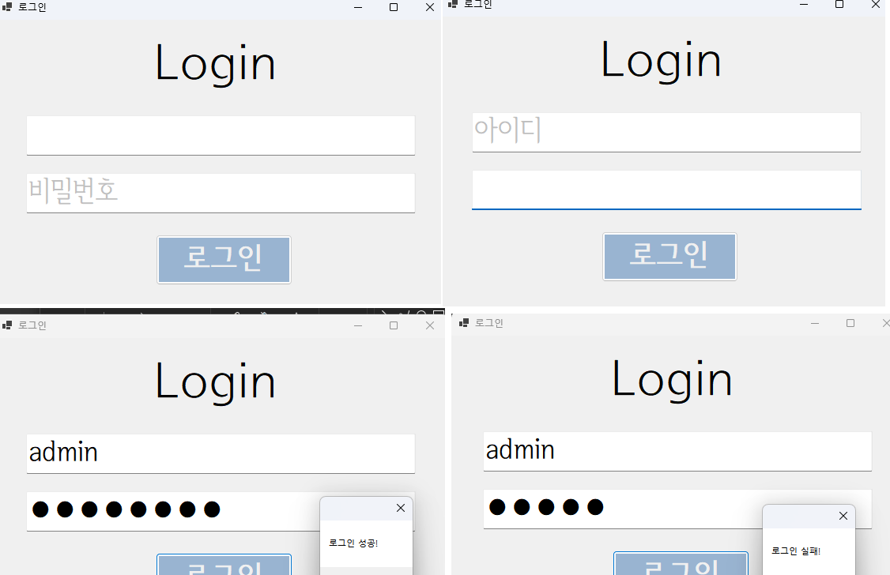
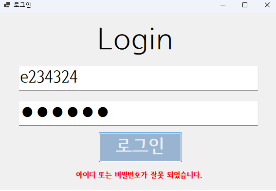
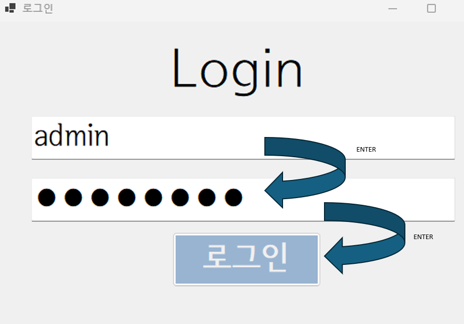

# (C# 코딩) 로그인 시스템 구현
## 개요
- C# 프로그래밍 학습
- 1줄 소개: 아이디/비밀번호가 일치하면 로그인이 되는 시스템을 구현해보자!
- 사용한 플랫폼:
  - C#, .NET Windows Forms, Visual Studio, GitHub
- 사용한 컨트롤:
  - Label, TextBox, Button
- 사용한 기술과 구현한 기능:
  - Visual Studio를 이용하여 UI 디자인
  - if문을 활용한 아이디/비밀번호 대조 및 일부 애니메이션 기능 구현
  - Messagebox를 이용한 초기 코드에서의 정보 전달
  - IsNullOrWhiteSpace을 이용한 텍스트박스 공백 체크
  - ForeColor로 텍스트박스 안 글자 색 바꾸기
  - UseSystemPasswordChar 기능을 통해 비밀번호 가리기 기능 구현
  - Visible 기능을 통해 특정 라벨을 켜고 끄는 기능을 구현
  - Keycode를 이용한 키바인딩 추가
  - PerformClick을 키바인딩에 연결하여 버튼 편의성 강화

## 실행 화면 (과제1)
- 과제1 코드의 실행 스크린샷

- 과제 내용
    - 위치에 맞게 로직들 위치시킴
        - 로그인 라벨을 상단 중앙, 그 아래에 아이디/비밀번호 텍스트박스, 그 아래에 로그인 버튼
    - 입력박스를 선택하면 텍스트박스 힌트 글자를 사라지게 함
    - 입력박스를 선택 해제했을 때 '공백'이면 힌트 글자가 다시 나타남
    - 아이디/비밀번호의 일치 여부에 따라 성공/실패 팝업
- 구현 내용과 기능 설명
    - 아이디/비밀번호의 텍스트박스에 Enter 상태일 때 각 변수의 TxT를 공백으로 바꿔서 힌트 문자가 사라지게 하고 Leave 상태일 때 IsNullOrWhiteSpace 상태를 체크하여 True일 경우 힌트텍스트를 다시 나타나게 함
    - ForeColor를 사용하여 실제 텍스트 입력 시 색깔을 Black, 힌트텍스트가 나타날 때에는 Silver 색깔로 표현되도록 함
    - 비밀번호일 경우 UseSystemPasswordChar의 true/false여부를 유연하게 적용하여 실제 텍스트 입력 시 OOOOO형식으로 암호화되서 나오게 하였으며 힌트 텍스트로 나타날 경우 다시 암호화를 풀게 하였음
    - 아이디/비밀번호를 && 연산자로 대조하여 성공 여부의 Messagebox를 출력함

- ## 실행 화면 (과제2)
- 과제2 코드의 실행 스크린샷

- 과제 내용
    - 기존 로그인 실패 메시지박스 제거
    - 라벨 추가 (아이디/비밀번호 오류)
    - 아이디/비밀번호 매칭 X > 오류 라벨 ON
    - 로그인 성공 > 오류 라벨 OFF
- 구현 내용과 기능 설명
    - 기존 로그인 실패 Messagebox 제거
    - lblErrorMsg.Visible의 true/false 여부로 로그인 오류 상태 출력

- ## 실행 화면 (과제3)
- 과제3 코드의 실행 스크린샷

- 과제 내용
    - 아이디 입력란 엔터 > 비밀번호로 이동
    - 비밀번호 입력란 엔터 > 로그인 버튼 누른 효과
- 구현 내용과 기능 설명
    - KeyCode Enter 입력 시 커서 클릭 필요 없이 다음 단계로 이동함
    - 아이디에서 Enter > 비밀번호 입력란으로 커서 이동 (focus)
    - 비밀번호에서 Enter > PerformClick으로 버튼 클릭 효과!

- ## 실행 화면 (과제4)
- 과제4 코드의 실행 스크린샷

- 과제 내용

- 구현 내용과 기능 설명
